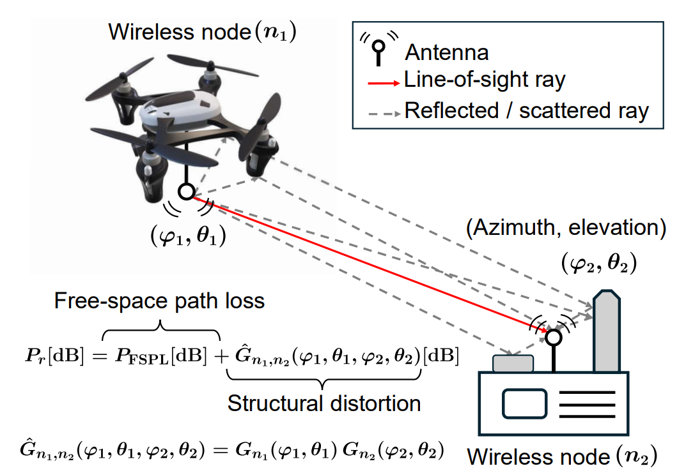
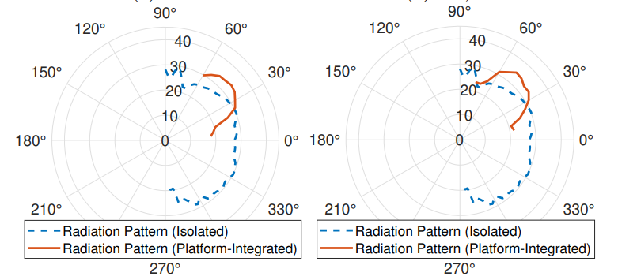
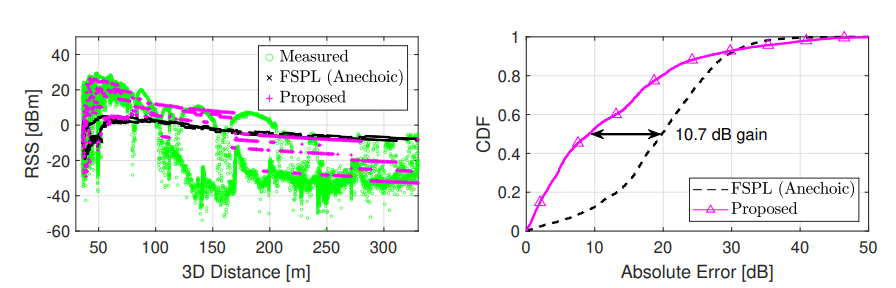
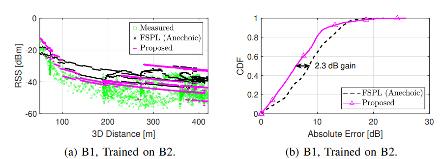

# Platform and Orientation Aware Channel Knowledge Mapping via Mutual Antenna Pattern Learning in 3D Wireless Links

This repository contains the MATLAB code for the paper **"Platform and Orientation Aware Channel Knowledge Mapping via Mutual Antenna Pattern Learning in 3D Wireless Links"**. The paper proposes a framework to characterize wireless links by learning the structural scattering and reflection effects induced by the physical platforms of both communication endpoints, modeled as a **mutual antenna pattern** dependent on both the angle of arrival (AoA) and angle of departure (AoD).

## General Introduction

In practical wireless deployments, communication terminals are integrated into physical platforms such as UAVs, ground vehicles, or base station structures. These platforms intrinsically alter the wireless channel through structural shadowing, reflections, and scattering — effects not captured by traditional anechoic chamber antenna measurements. This work proposes to learn these effects directly from noisy, sparse field measurements using a least-squares (LS) framework, and incorporates the result into a modified free-space path loss (FSPL) model.

<p align="center">
  
  <br>
  <em>Fig. 1: Wireless link between two nodes with integrated physical structures. Reflections and scattering from the node bodies create multipath components that depend on their 3D orientations. The combined effect is captured by the learned mutual antenna pattern.</em>
</p>

The key idea is that the received power can be expressed as:

$$P_r[\text{dB}] = P_{\text{FSPL}}[\text{dB}] + \hat{G}_{n_1,n_2}(\varphi_1, \theta_1, \varphi_2, \theta_2)[\text{dB}]$$

where the mutual antenna gain $\hat{G}_{n_1,n_2}$ is estimated from field data and captures the joint structural influence of both platforms.

### Key Highlights

- **Framework**: Least-squares estimation of the mutual antenna pattern from sparse, noisy RSS measurements collected in the field.
- **Datasets**: Two publicly available AERPAW datasets — UAV-UGV links (Dataset 1 / AFAR) and tower-UAV links (Dataset 2 / multi-BW).
- **Result**: The learned mutual pattern reduces path loss estimation error by up to **10 dB** compared to anechoic chamber baselines, with as few as **10 measurements per joint angular bin**.
- **Bandwidth robustness**: Consistent performance gain across 0.125 MHz to 5 MHz bandwidth range.

## Representative Results

Reconstructed mutual antenna gain as a function of elevation angle (Fig. 2):

<p align="center">
  
  <br>
  <em>Fig. 2: Snapshot of reconstructed mutual antenna gain. Platform-integrated patterns (solid) diverge significantly from isolated anechoic chamber patterns (dashed).</em>
</p>

RSS prediction performance for Dataset 1 — UAV/UGV link (Fig. 3):

<p align="center">
  
  <br>
  <em>Fig. 3: RSS prediction for test experiments A1 and A3. The proposed method better captures structural shadowing at low elevation angles and constructive interference at short distances.</em>
</p>

RSS prediction performance for Dataset 2 — tower/UAV link (Fig. 4):

<p align="center">
  
  <br>
  <em>Fig. 4: RSS prediction for test experiments B1 and B2.</em>
</p>

## Repository Structure

```
mutual_ant_patt_orientation/
├── mutual_ant_patt/
│   ├── afar_mutual_ant_patt.mat       # Precomputed mutual antenna pattern — Dataset 1 (AFAR)
│   └── cole_mutual_ant_patt.mat       # Precomputed mutual antenna pattern — Dataset 2 (multi-BW)
├── data_gen/                          # Data preprocessing scripts (shared with uav-spectrum-sensing-insights)
│   ├── AFAR_dataset/
│   │   └── data_gener_afar_sensors.m
│   └── Multi_BW_dataset/
│       └── data_gener_cole_sensors.m
├── afar_main.m                        # Generates Fig. 3 (Dataset 1 RSS performance)
├── cole_main.m                        # Generates Fig. 4 (Dataset 2 RSS performance)
├── png/                               # Figures for README
├── .gitignore
└── README.md
```

> **Note on `mutual_ant_patt/` folder**: The `.mat` files inside this folder contain the precomputed mutual antenna patterns used to generate Fig. 2(a)–(b) (`afar`) and Fig. 2(c)–(d) (`cole`). These are loaded directly by the main scripts.

## How to Run

### Prerequisites

- MATLAB R2022b or newer
- Required MATLAB Toolboxes:
  - `Signal Processing Toolbox`
  - `Statistics and Machine Learning Toolbox`

### Clone the Repository

```bash
git clone https://github.com/MPACT-Lab/mutual_ant_patt_orientation.git
```

### Data Preprocessing (optional — if running from scratch)

The `data_gen` scripts are shared with the [uav-spectrum-sensing-insights](https://github.com/MPACT-Lab/uav-spectrum-sensing-insights) repository. To preprocess raw data:

```bash
cd data_gen/AFAR_dataset
```
Run `data_gener_afar_sensors.m` for Dataset 1 (AFAR).

```bash
cd data_gen/Multi_BW_dataset
```
Run `data_gener_cole_sensors.m` for Dataset 2 (multi-BW / cole).

### Generate Main Results

**Fig. 3 — RSS performance for Dataset 1 (UAV-UGV link):**
```matlab
run('afar_main.m')
```

**Fig. 4 — RSS performance for Dataset 2 (tower-UAV link):**
```matlab
run('cole_main.m')
```

**Fig. 2 — Reconstructed mutual antenna gain patterns:**

The patterns are loaded from:
- `mutual_ant_patt/afar_mutual_ant_patt.mat` → Fig. 2(a) and 2(b)
- `mutual_ant_patt/cole_mutual_ant_patt.mat` → Fig. 2(c) and 2(d)

These `.mat` files are automatically used by `afar_main.m` and `cole_main.m`.

## Datasets

This work uses two publicly available AERPAW datasets:

- **Dataset 1 (AFAR)**: UAV-UGV wireless link measurements.
  > S. Masrur et al., "Collection: UAV-based RSS measurements from the AFAR challenge," *IEEE Data Descrip.*, 2025.

- **Dataset 2 (multi-BW / cole)**: Tower-UAV wireless link measurements at varying altitudes and bandwidths.
  > C. Dickerson et al., "AERPAW UAV-based signal data collected at varying altitudes and sampling rates," *IEEE Dataport*, 2024. https://doi.org/10.5061/dryad.2z34tmpvv

## Citing This Work

If you use this code or refer to this work in your research, please cite:

```bibtex
@article{rahman2026mutual,
  author    = {Mushfiqur Rahman and {\.I}smail G{\"u}ven{\c{c}} and Jason A. Abrahamson and Arupjyoti Bhuyan},
  title     = {Platform and Orientation Aware Channel Knowledge Mapping via Mutual Antenna Pattern Learning in {3D} Wireless Links},
  journal   = {IEEE Wireless Communications Letters},
  year      = {2026}
}
```

## Acknowledgment

This research is supported in part by NSF awards CNS-2332835 and CNS-2450593, and in part by the Idaho National Laboratory (INL) Laboratory Directed Research and Development (LDRD) Program under DOE Contract DE-AC07-05ID14517. Measurement data is provided by the NSF [AERPAW](https://aerpaw.org) platform.

## License

This code is released under the MIT License.

## Contact

For questions, feel free to open an issue or contact us at **iguvenc@ncsu.edu**.
